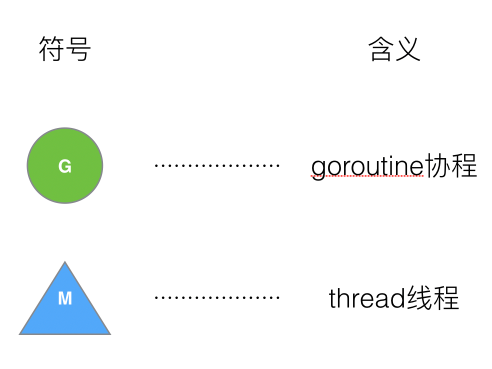

# Golang 的调度器

[参考地鼠文档](https://www.topgoer.cn/docs/golangxiuyang/golangxiuyang-1cmeduvk27bo0)

### 1. 旧版本的调度器




> M想要执行、放回G都必须访问全局G队列，并且M有多个，即多线程访问同一资源需要加锁进行保证互斥/同步，所以全局G队列是有互斥锁进行保护的

**缺点**
```text
1) 创建、销毁、调度G都需要每个M获取锁，这就形成了激烈的锁竞争。
2) M转移G会造成延迟和额外的系统负载。比如当G中包含创建新协程的时候，M创建了G’，为了继续执行G，需要把G’交给M’执行，也造成了很差的局部性，因为G’和G是相关的，最好放在M上执行，而不是其他M’。
3) 系统调用(CPU在M之间的切换)导致频繁的线程阻塞和取消阻塞操作增加了系统开销
```

### 2. GMP调度模型
> 新调度器中，除了M(thread)和G(goroutine)，又引进了P(Processor)


> Processor，它包含了运行goroutine的资源，如果线程想运行goroutine，必须先获取P，P中还包含了可运行的G队列

#### 2.1 GMP
> 在Go中，线程是运行goroutine的实体，调度器的功能是把可运行的goroutine分配到工作线程上


- 全局队列（Global Queue）：存放等待运行的G。
- P的本地队列：同全局队列类似，存放的也是等待运行的G，存的数量有限，不超过256个。新建G’时，G’优先加入到P的本地队列，如果队列满了，则会把本地队列中一半的G移动到全局队列。
- P列表：所有的P都在程序启动时创建，并保存在数组中，最多有GOMAXPROCS(可配置)个。
- M：线程想运行任务就得获取P，从P的本地队列获取G，P队列为空时，M也会尝试从全局队列拿一批G放到P的本地队列，或从其他P的本地队列偷一半放到自己P的本地队列。M运行G，G执行之后，M会从P获取下一个G，不断重复下去。

> Goroutine调度器和OS调度器是通过M结合起来的，每个M都代表了1个内核线程，OS调度器负责把内核线程分配到CPU的核上执行


#### 2.2 P和M的数量
```go
/*
P的数量：
    由启动时环境变量$GOMAXPROCS或者是由runtime的方法GOMAXPROCS()决定。这意味着在程序执行的任意时刻都只有$GOMAXPROCS个goroutine在同时运行。
*/

// 通过该方法设置p 的数量
runtime.GOMAXPROCS($numberr)

/*
M的数量:
    go程序启动时，会设置M的最大数量，默认10000.但是内核很难支持这么多的线程数，所以这个限制可以忽略。
    runtime/debug中的SetMaxThreads函数，设置M的最大数量
    一个M阻塞了，会创建新的M
*/

// 通过该方法指定M的数量
debug.SetMaxThreads($thredNumber)
```
#### 2.3 P和M何时会被创建
> 1. P何时创建: 在确定了P的最大数量n后，运行时系统会根据这个数量创建n个P。
>
> 2. M何时创建：没有足够的M来关联P并运行其中的可运行的G。比如所有的M此时都阻塞住了，而P中还有很多就绪任务，就会去寻找空闲的M，而没有空闲的，就会去创建新的M

### 3. go func() 执行流程


**执行流程**
- 1. 我们通过 go func()来创建一个goroutine
- 2. 有两个存储G的队列，一个是局部调度器P的局部队列、一个是全局G队列。新创建的G会先保存在P的局部队列中，如果P的局部队列已经满了就会保存在全局的队列中
- 3. G只能运行在M中，一个M必须持有一个P，M与P是1：1的关系。M会从P的本地队列弹出一个可执行状态的G来执行，如果P的局部队列和全局队列都为空，就会想其他的MP组合偷取一个可执行的G来执行
- 4. 一个M调度G执行的过程是一个循环机制
- 5. 当M执行某一个G时候如果发生了syscall或则其余阻塞操作，M会阻塞，如果当前有一些G在执行，runtime会把这个线程M从P中摘除(detach)，然后再创建一个新的操作系统的线程(如果有空闲的线程可用就复用空闲线程)来服务于这个P
- 6. 当M系统调用结束时候，这个G会尝试获取一个空闲的P执行，并放入到这个P的本地队列。如果获取不到P，那么这个线程M变成休眠状态， 加入到空闲线程中，然后这个G会被放入全局队列中

### 4. 调度器的生命周期


> **M0:** M0是启动程序后的编号为0的主线程，这个M对应的实例会在全局变量runtime.m0中，不需要在heap上分配，M0负责执行初始化操作和启动第一个G， 在之后M0就和其他的M一样了。

> **G0:** G0是每次启动一个M都会第一个创建的gourtine，G0仅用于负责调度的G，G0不指向任何可执行的函数, 每个M都会有一个自己的G0。在调度或系统调用时会使用G0的栈空间, 全局变量的G0是M0的G0

### 5. Go调度器的不同场景
#### 5.1 局部性（协程创建的子协程添加到当前绑定的P-M的本地队列）


> 当程序运行之后，P和M1进行绑定，P都是运行在绑定的M上；此时P的本地队列中有G1，正在进行运行，当G1运行中需要另起一个goroutine即G2时，使用go func() 创建，G2会优先添加到当前P-M所绑定的P本地队列。好处：子鞋程可能会共享资源，减少了资源复制以及上下文切换的CPU开销；即创建的些称会优先添加到与至向关的Processer中

#### 5.2 协程执行完毕（使用每个M所创建的G0进行goroutine切换）


> 当G1执行完毕，M上运行的goroutine会先切换为G0，有G0统一负责调度协程切换(使用schedule进行调度),从本地队列P中获取goroutine,并开始执行协程(execute).从而实现了对os thread M1的重复使用

#### 5.3 创建G时唤醒自旋线程


> 在创建协程时，就会去唤醒os Thread Queue中的M，尝试去进行与空闲的Processer进行绑定，进行P-M组合。如果没有M，则不进行操作；如果全局队列中有M或者存在多个M，则取出M，队列中剩余的M前移，如果没有空闲的P，则返回队列中；当有空闲的P时，则进行绑定，绑定之后，就会产生G0调度协程进行初始化与调度；如果新绑定的P本地队列中没有goroutine，则线程一直处于等待状态，尝试work stealing 或从全局中获取待执行的任务；在此期间，G0在一直寻找任务，此时的线程为自旋线程

#### 5.4 GMP内部的负载均衡（被唤醒的线程从全局队列中获取G）


> 当P-M组合完成后，G0将会不断的去寻找执行的G，会优先从GQ(Global Queue)中获取批量的G，如果GQ(Global Queue)中存在待执行的goroutine，则会采用负载均衡的算法进行计算需要取出的G的数量
> **n = min(len(GQ)/GOMAXPROCS + 1, len(GQ)/2)**
>
>其中GQ为全局队列中保存的G的数量， GOMAXPROCS为设置的P的最大使用核数，一般默认为当前最大核数，然后计算出二者最小值为从全局队列中获取的数量，将其放入新P-M组合中P的本地队列中，然后由G0进行调度执行,一般从全局队列中取出的G至少一个

#### 5.5 P本地队列和GQ皆为空时，从别地P中偷取G（M2从M1的本地队列中偷取goroutine）


> 当M2中的处理器P2将本地队列中的任务执行完毕后，并且此时全局队列也不存在G；此时M2将会执行work stealing 操作，从其他存在G的processer的本地队列中偷取一半的G，将其放在本地队列中；如上图所示，M2将从P1的尾部偷取一半的G（向下取整），即G8将被偷取存入到P2的本地队列中，然后又M2的G0进行调度执行

#### 5.6 进程中没有可运行的G，自旋线程的最大数目(即GOMAXPROCS)


>  当进程中所有的线程M所绑定的P处理器本地队列中没有G，同时全局队列中无待执行的G时，此时进程中将会存在GOMAXPROCS数量个线程处于自旋状态；其他产生的线程将会保存在全局线程队列中处于休眠状态，等待下次被调度唤醒进行任务绑定